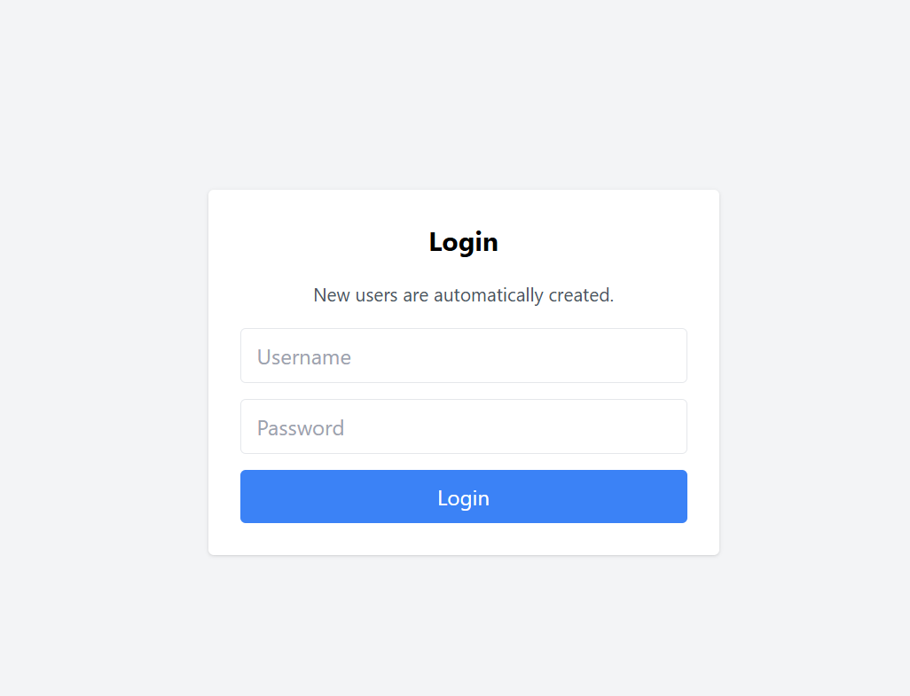
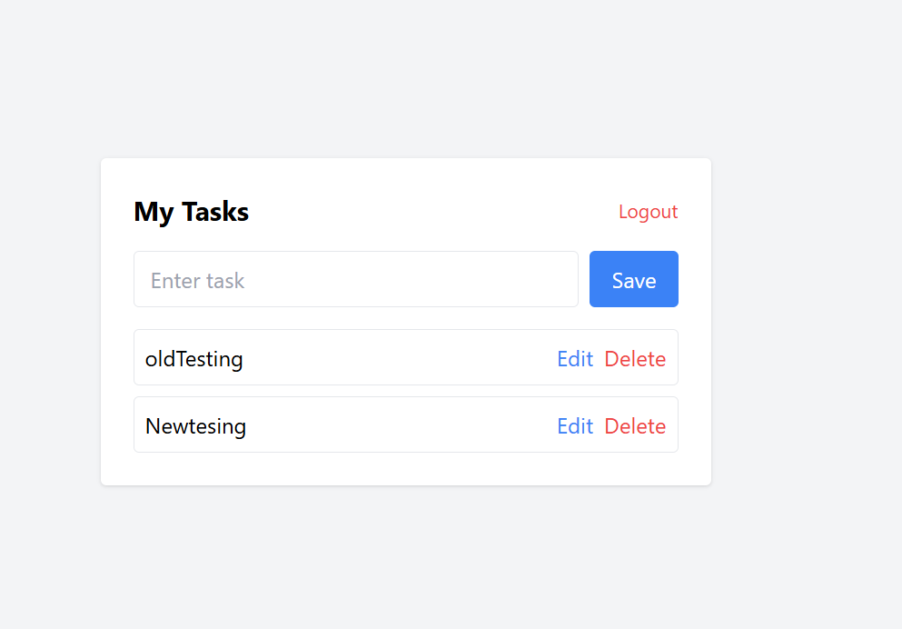

Sample Readme (delete the above when you're ready to submit, and modify the below so with your links and descriptions)
---

## Your Web Application Title
Restrepo, David: Render or AWS link

The goal of this project was to create a three-tier web application that allows users to log in and manage their own tasks using a persistent MongoDB database. Users can
add, edit, and delete tasks, and only see data associated with their account.

A key challenge was implementing user authentication using browser localStorage instead of a traditional authentication system, while correctly associating data with
individual users. Coordinating data flow between the client, Express server, and MongoDB was also a challenge.

The application uses Tailwind CSS for styling because it provides a clean, professional design with minimal custom CSS. No significant modifications were made to the
framework beyond minor layout and spacing adjustments. 

## Technical Achievements
- **Tech Achievement 1**: This project was deployed using Vercel instead of Render. Compared to Render, this platform provided
faster deployment times and a simpler integration workflow for Node.js applications. In particular, automatic redeployments on GitHub pushes made iteration easier. However,
configuring environment variables and database connections required more manual setup than on Render. Overall, this platform offered greater flexibility, but required a 
deeper understanding of deployment configuration.

## Design/Evaluation Achievements
- **Design Achievement 1**: 
